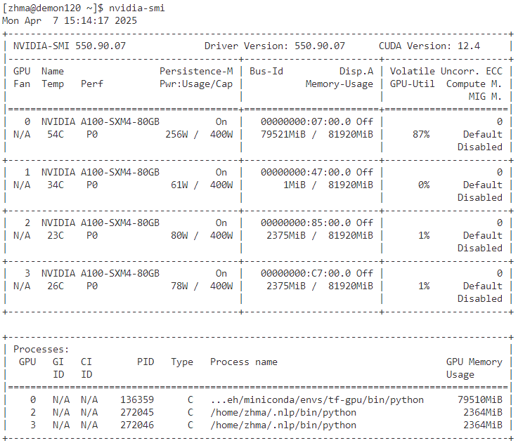

# Purpose
This document explains how to submit Accelerate and other general jobs on the Demon cluster, which uses SLURM for job scheduling.

# Most Important Lessons
- **`srun`** will execute the script `ntasks` times.
- For Accelerate, I need to run the `accelerate launch` on each node exactly once. Using `ntasks-per-node=1` solves this issue.

# Experiments

1. **Experiment 1**: Request 3 nodes on `defq`:
    - **Output**: `output_exp1.txt`
    - SLURM flags used: `--gpus=3`, `--partition=defq`
    
2. **Experiment 2**: Request 2 GPUs on the GPU partition, but on a single node (`demon120`):
    - **Output**: `output_exp2.txt`
    - SLURM flags used: `--gpus=2`, `--partition=gpu`, `--nodelist=demon120`

3. **Experiment 3**: Request 2 GPUs on the GPU partition, but on a single node (`demon121`):
    - **Output**: `output_exp3.txt`
    - SLURM flags used: `--gpus=2`, `--partition=gpu`, `--nodelist=demon121`

4. **Experiment 4**: Request 2 GPUs on the GPU partition, but spread across 2 nodes:
    - **Output**: `output_exp4.txt`
    - SLURM flags used: `--gpus=2`, `--partition=gpu`, `--nodes=2`, `--gpus-per-node=1`

### Overwriting Another User's GPU?

While working on the GPU partition, it is essential to assume that other jobs might be running on GPUs. To simulate this, I start an interactive sessions on both `demon120` and `demon121` nodes. Then, I submit jobs using `sbatch` from another terminal, SSH into the nodes, and use `nvidia-smi` to check GPU usage. This helps ensure that my batch jobs are not running on GPUs already occupied by interactive jobs.

It’s worth noting that, even though the GPU IDs provided by `$SLURM_STEP_GPUS` are correct, the actual output tensor GPU IDs are numbered from 0 upwards. For example, in the screenshot below, we observe:
- Someone else is using the actual GPU 0.
- My batch job is using GPUs 2 and 3.
- GPU 1 is idle.

(see also output_exp4_echo.txt for another example using 2 nodes, which shows the `$SLURM_STEP_GPUS` are the actual GPU IDs)

This suggests that either `torch.dist` or `Accelerate` automatically maps the GPU IDs, so users do not need to manually handle GPU ID assignments.

